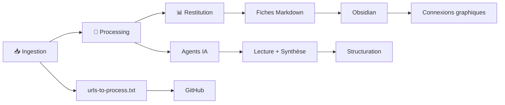

# Mon Assistant IA : Infrastructure de Veille Technique

> Comment j'ai transformé ma veille volatile en système de connaissance structuré

[](LICENSE)
[](https://github.com/saboiteau/MonAssistantIAv2)

---

## 🎯 Le Problème

Pendant 15 ans, j'ai consommé une quantité astronomique de contenu sans jamais pouvoir le retrouver.

Articles, conférences, podcasts, études... **Le vrai problème ?** Pas le volume. La **volatilité**.

Lire un article dans le bus le matin et être incapable d'en retrouver l'URL ou les idées clés quelques heures plus tard.  
**Perte sèche de temps et de compétence.**

Pour qu'une veille soit utile, elle doit être **digérée, structurée et consultable**.  
Mais tout arrêter pour rédiger manuellement une fiche de synthèse à chaque URL ?  
**Impossible de tenir le rythme.** C'est la friction ultime.

---

## 💡 Ma Solution : Le "Second Brain" Technique

Depuis octobre 2025, j'ai décidé de traiter ma veille comme un projet logiciel : **automatisé, versionné, conversationnel**.

### Architecture en 3 Piliers



**1. Ingestion** : `urls-to-process.txt` (GitHub, accessible partout)  
**2. Processing** : Agents IA qui lisent, synthétisent, structurent  
**3. Restitution** : Fiches Markdown (liées entre elles, consultables sur GitHub)

### 🌟 Ma Valeur Ajoutée Unique

**La plupart des gens s'arrêtent à la synthèse.**

Moi, j'ai ajouté **la critique et la perspective**.

Chaque fiche contient :
- 💡 **Concepts clés** : L'essentiel en bullet points
- 📝 **Résumé analytique** : 400 mots structurés
- 🛠️ **Actions concrètes** : Outils et méthodes applicables
- **💭 Critique** : Lien avec MES convictions (IA conviviale, Human-ON-the-loop, Context Engineering)

**Pourquoi ?** Parce qu'une veille sans **angle de lecture** reste une collection de faits.

**Résultat :** Ma veille ne me dit pas juste "ce qui se passe".  
Elle me dit **"ce que ça signifie pour ma pratique"**.

---

## 📊 Résultats Concrets

- ✅ **44 fiches** analysées en 2,5 mois (octobre-décembre 2025)
- ✅ **Croissance exponentielle** : 3 → 14 → 27 fiches/mois
- ✅ **40+ prompts** réutilisables organisés par cas d'usage
- ✅ **Zéro perte d'information** : Tout est capturé, structuré, retrouvable
- ✅ **Convergences émergentes** : Le système révèle des patterns invisibles

**Exemples concrets de convergences révélées :**

**Agent Engineering** (Philippe Ensarguet) → Ma fiche connecte :
- API-First comme colonne vertébrale (ADEO)
- Semantic mesh vs catalogues plats
- Governance dynamique (guardrails vs gates)

**Spec-Driven Development** (GitHub) → Ma fiche révèle le lien avec :
- TOM Agentique (redessiner l'organisation)
- "Lâcher le comment" pour se concentrer sur le "quoi"
- Human-ON-the-loop (Jurgen Appelo)

**Coding Agents & Complexity Budgets** (Lee Robinson) → Ma fiche analyse :
- 260$ pour éliminer 322K lignes de code
- Le coût des abstractions avec l'IA
- Dette technique à l'ère agentique

**Sans ce système, je n'aurais jamais vu ces convergences.**

---

## 🚀 Quick Start

### Installation

```bash
git clone https://github.com/saboiteau/MonAssistantIAv2.git
cd MonAssistantIAv2
```

### Utilisation Basique

1. **Ajoutez une URL** dans `urls-to-process.txt`
2. **L'agent génère** une fiche structurée dans `Veille/fiches/YYYY-MM/`
3. **Consultez** directement sur GitHub ou dans votre éditeur Markdown préféré

### Configuration Rapide

```bash
# Activez la configuration complète
"Applique ma config standard"
```

Cette commande active automatiquement :
- ✅ Règles "Ne pas mentir" (rigueur intellectuelle)
- ✅ Mes 13 Spécialités (Product Operating Models, Agents IA, Context Engineering)
- ✅ Banque de Prompts (40+ prompts réutilisables)
- ✅ Veille (44 fiches analysées avec critique + perspective)

**Documentation complète** : [CONFIGURATION_ASSISTANT.md](CONFIGURATION_ASSISTANT.md)

---

## 📂 Structure du Repo

```
Mon Assistant IA V2/
├── 📚 Veille/                    # 44 fiches analysées (oct-déc 2025)
│   ├── fiches/                   # Fiches structurées par mois
│   │   ├── 2025-10/              # 3 fiches
│   │   ├── 2025-11/              # 14 fiches
│   │   └── 2025-12/              # 27 fiches
│   ├── index.md                  # Catalogue complet
│   └── README.md                 # Guide de navigation
│
├── 🚀 Banque_de_Prompts/         # 40+ prompts réutilisables
│   ├── Gestion_Projet/
│   ├── Communication/
│   ├── Redaction/
│   └── README.md
│
├── 🤖 AGENTS_QUOTIDIENS.md       # Agents IA prêts à l'emploi
│   ├── Agent Namer               # Expert branding
│   ├── RAG                       # Retrieval-Augmented Generation
│   └── Gardien du Savoir         # Expert documentation
│
├── 🧠 Connaissances/             # Second Brain pérenne
│   └── psychologie-et-management.md
│
├── ✍️ LinkedIn et articles/      # Articles publiés
│   └── publies/
│
├── 📖 CONFIGURATION_ASSISTANT.md # Context Engineering
├── 📖 GUIDE_RAPIDE_COMMANDES.md  # Aide-mémoire
└── 📖 EXEMPLES_UTILISATION.md    # Cas d'usage concrets
```

---

## 🎓 Pour Qui ?

### Product Leaders
Cherchant à structurer leur veille et capitaliser sur leurs lectures

### Consultants en Transformation
Voulant des références crédibles et une base de connaissance évolutive

### Managers à l'ère de l'IA
Cherchant à comprendre les convergences entre concepts (Human-ON-the-loop, Pyramide de Dilts, Agent Engineering)

### Passionnés de Knowledge Management
Voulant un système reproductible de "Second Brain" technique

---

## 🛠️ Technologies Utilisées

- **Ingestion** : Fichier texte simple (`urls-to-process.txt`)
- **Versioning** : Git + GitHub (historique complet, branches, rollback)
- **Processing** : LLMs (Gemini CLI, Claude Code) via agents conversationnels
- **Restitution** : Markdown (compatible avec tout éditeur : VS Code, Obsidian, Notion)
- **Workflow** : PowerShell scripts (automation)

**Pourquoi cette stack ?**
- ✅ Simple (pas de dépendances complexes)
- ✅ Souveraine (données sous contrôle)
- ✅ Évolutive (facile d'ajouter des agents)
- ✅ Transparente (tout est auditable)

---

## 🤝 Contribuer

Les contributions sont les bienvenues ! Voici comment participer :

1. **Fork** le projet
2. **Créez** une branche (`git checkout -b feature/AmazingFeature`)
3. **Committez** vos changements (`git commit -m 'Add some AmazingFeature'`)
4. **Push** vers la branche (`git push origin feature/AmazingFeature`)
5. **Ouvrez** une Pull Request

Consultez [CONTRIBUTING.md](CONTRIBUTING.md) pour plus de détails.

---

## 📝 Licence

Ce projet est sous licence MIT - voir le fichier [LICENSE](LICENSE) pour plus de détails.

**En résumé :** Vous pouvez utiliser, modifier, distribuer ce code librement.  
Attribution appréciée mais non obligatoire.

---

## 🔗 Liens Utiles

- **LinkedIn** : [Sandrine Boiteau](https://www.linkedin.com/in/sandrine-boiteau/)
- **WEnvision** : [wenvision.com](https://www.wenvision.com)
- **Kit de Duplication** : [KitAssistantIA](https://github.com/saboiteau/KitAssistantIA)

---

## 💬 Contact

**Sandrine Boiteau**  
Co-founder WEnvision | Expert Product Operating Models & Agents IA

- LinkedIn : [Sandrine Boiteau](https://www.linkedin.com/in/sandrine-boiteau/)
- Email : [contact via WEnvision](https://www.wenvision.com/fr/contact/)

---

## 🙏 Remerciements

Merci à tous ceux qui ont contribué à ce projet, directement ou indirectement :
- **Jurgen Appelo** : Concept Human-ON-the-loop
- **Ivan Illich** : IA conviviale vs extractive
- **WEnvision** : "Lâcher le comment"
- **GitHub** : Spec-Driven Development
- **Communauté open source** : Inspiration et outils

---

*Dernière mise à jour : 22 décembre 2025*

**⭐ Si ce projet vous aide, n'hésitez pas à lui donner une étoile !**
